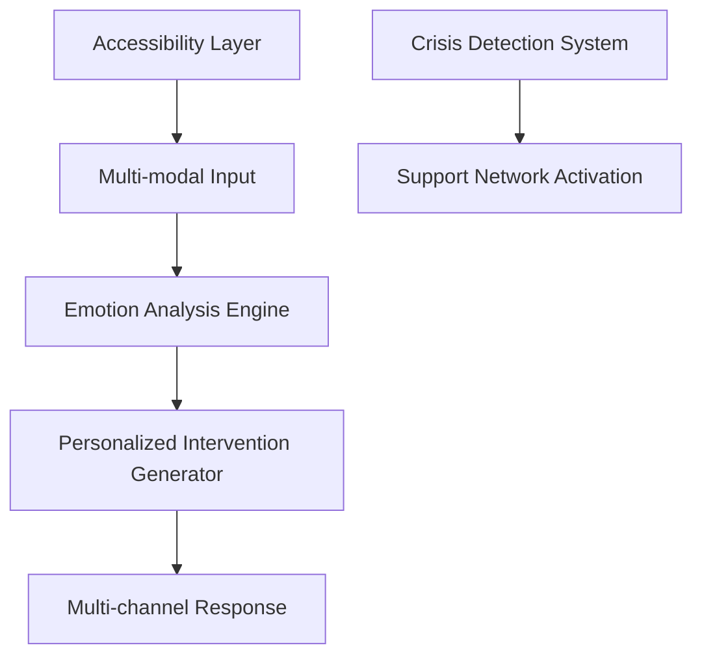

# 🧠 Manas: Youth Mental Wellness Platform

**Google GenAI Exchange Hackathon 2025 Strategy Document**

## 📋 Table of Contents
1. [Problem Statement Analysis](#problem-statement-analysis)
2. [Recommended Solution: Manas](#recommended-solution-manas)
3. [Competitive Analysis](#competitive-analysis)
4. [Technical Architecture](#technical-architecture)
5. [Implementation Strategy](#implementation-strategy)
6. [Scalability & Practical Considerations](#scalability--practical-considerations)
7. [Datasets & Technical Resources](#datasets--technical-resources)
8. [Timeline & Execution Plan](#timeline--execution-plan)

---

## Problem Statement Analysis

### 🎯 Generative AI for Youth Mental Wellness

**Challenge:**
> The journey through education and early adulthood is often fraught with stress, anxiety, and pressure, which can significantly impact the mental well-being of young individuals. There is a growing need for accessible, confidential, and empathetic platforms that can provide initial support, guidance, and coping strategies for mental health issues before they escalate.

**Objective:**
> Create an innovative solution using Google Cloud's Generative AI to provide a supportive environment for youth mental wellness. The solution should act as a proactive and empathetic guide, offering personalized coping mechanisms, mindfulness exercises, and positive reinforcement. It should go beyond a simple Q&A bot to foster a sense of connection and understanding, helping users navigate their emotional challenges and promoting mental resilience.

### Why This Problem Statement Is Optimal For You

1. **Technical Alignment:** Your existing skills in:
   - Multi-modal AI processing (vision, voice, text)
   - Accessibility features (eye tracking, sign language)
   - Emotion analysis (from teacher wellbeing agent)

2. **Strategic Advantage:** Most teams will build simple chatbots - your sophisticated technical background allows for a truly differentiated solution

3. **Social Impact:** Mental health is critically underserved in India, particularly for youth

4. **Existing Codebase:** Your Sarathi+/Sahayak+ platform provides an excellent foundation with its wellbeing agent, accessibility features, and multi-language support

---

## Recommended Solution: Manas

### Core Concept

**Manas** is a multi-modal mental wellness platform specifically designed for Indian youth that goes beyond traditional chatbot approaches by incorporating:

1. **Multi-modal Emotional Intelligence:** Using computer vision, voice analysis, and text processing to understand emotional states

2. **Accessibility-First Design:** Supporting users with various disabilities through eye tracking, sign language, and adaptive interfaces

3. **Creative Therapy Generation:** AI-generated art therapy, journaling prompts, and mindfulness exercises

4. **Crisis Detection & Response:** Intelligent recognition of serious issues requiring professional intervention

5. **Cultural Sensitivity:** Deep understanding of Indian cultural contexts and regional language support

### Unique Selling Points

- **Beyond Text:** While most solutions will focus on text-only interactions, Manas understands emotions through multiple channels
- **True Accessibility:** Serving users with disabilities who are often overlooked in mental health solutions
- **Offline Capabilities:** Functioning in low-connectivity environments common in many parts of India
- **Culturally Grounded:** Deeply rooted in Indian cultural contexts and regional languages

---

## Competitive Analysis

| Typical Hackathon Solutions | Your Manas Advantage |
|----------------------------|----------------------|
| Simple Q&A chatbots | Multi-modal emotion understanding (vision, voice, text) |
| Generic advice | Personalized therapy generation based on emotional state |
| English-only | Support for multiple Indian languages |
| Requires constant connectivity | Works offline with sync-when-available |
| Ignores accessibility | Eye tracking and sign language support |
| Basic crisis detection | Sophisticated pattern recognition for early intervention |

---

## Technical Architecture

### Core System Components



### Key Technology Stack

1. **Frontend**
   - React Native (cross-platform mobile)
   - TensorFlow.js (client-side ML)
   - Progressive Web App capabilities
   - WebRTC for real-time communication

2. **Backend**
   - Flask (leveraging your existing expertise)
   - Google Cloud Run for serverless scaling
   - Firebase for real-time features
   - SQLite with sync capabilities

3. **AI/ML**
   - Google Gemini 2.5 Flash (primary generative model)
   - MediaPipe (emotion detection, gesture recognition)
   - Google Speech-to-Text & Text-to-Speech
   - TensorFlow Lite (on-device processing)

4. **Data Storage**
   - Firestore (user data)
   - Cloud Storage (media)
   - SQLite (local caching)
   - Vector database for semantic search

5. **DevOps**
   - Docker containerization
   - CI/CD with GitHub Actions
   - Monitoring with Cloud Monitoring

### Architecture Extensions from Sarathi+

The new architecture extends your Sarathi+ platform with:

```python
class ManasMentalWellnessEngine:
    def __init__(self):
        # Core components from Sarathi+
        self.gemini_client = GeminiClient()
        self.multi_language_processor = MultiLanguageProcessor()
        self.accessibility_engine = AccessibilityEngine()
        
        # New components for Manas
        self.emotion_detector = EmotionDetector()
        self.therapy_generator = TherapyGenerator()
        self.crisis_detector = CrisisDetector()
        self.offline_manager = OfflineCapabilityManager()
```

---

## Implementation Strategy

### 1. Forking Existing Codebase

Leverage your Sarathi+/Sahayak+ platform:

```bash
# Create new project
cp -r sarathi_plus/ manas_wellness/
cd manas_wellness/
git init
```

### 2. Core System Implementation

```python
# Emotion Analysis Engine
class EmotionAnalysisEngine:
    def __init__(self):
        self.face_emotion = MediaPipeEmotionDetector()
        self.voice_emotion = VoiceEmotionAnalyzer()
        self.text_emotion = TextSentimentAnalyzer()
        self.fusion_model = MultiModalFusion()
        
    def analyze_emotional_state(self, inputs):
        # Perform multi-modal analysis
        face_results = self.face_emotion.detect(inputs.video_frame)
        voice_results = self.voice_emotion.analyze(inputs.audio)
        text_results = self.text_emotion.analyze(inputs.text)
        
        # Fuse results for higher accuracy
        return self.fusion_model.fuse([face_results, voice_results, text_results])
```

### 3. Therapy Generation System

```python
# Creative Therapy Generator
class TherapyGenerator:
    def __init__(self):
        self.gemini_client = GeminiClient()
        self.user_profile_manager = UserProfileManager()
        self.therapy_templates = TherapyTemplateManager()
        
    def generate_personalized_therapy(self, emotional_state, user_profile):
        therapy_type = self.select_appropriate_therapy(emotional_state, user_profile)
        
        if therapy_type == "art":
            return self.generate_art_therapy(emotional_state)
        elif therapy_type == "journal":
            return self.generate_journaling_prompt(emotional_state)
        elif therapy_type == "mindfulness":
            return self.generate_mindfulness_exercise(emotional_state)
        # More therapy types
```

### 4. Accessibility Integration

```python
# Eye Tracking Navigation
class EyeTrackingInterface:
    def __init__(self):
        self.eye_tracker = MediaPipeEyeTracker()
        self.gaze_predictor = GazePredictor()
        self.ui_element_mapper = UIElementMapper()
        
    def process_frame(self, frame):
        eye_landmarks = self.eye_tracker.detect_landmarks(frame)
        gaze_point = self.gaze_predictor.predict_gaze(eye_landmarks)
        target_element = self.ui_element_mapper.find_element_at(gaze_point)
        return target_element
```

### 5. Crisis Detection System

```python
# Crisis Detection
class CrisisDetectionSystem:
    def __init__(self):
        self.pattern_analyzer = BehavioralPatternAnalyzer()
        self.risk_classifier = RiskLevelClassifier()
        self.intervention_manager = InterventionManager()
        
    def analyze_risk_level(self, user_data):
        patterns = self.pattern_analyzer.extract_patterns(user_data)
        risk_level = self.risk_classifier.classify_risk(patterns)
        
        if risk_level >= 0.8:  # High risk
            return self.intervention_manager.emergency_protocol()
        elif risk_level >= 0.5:  # Moderate risk
            return self.intervention_manager.support_resources()
        else:
            return self.intervention_manager.preventative_guidance()
```

---

## Scalability & Practical Considerations

### Scalability Challenges & Solutions

1. **Computational Resource Requirements**
   - **Challenge:** Multi-modal analysis (video, audio, text) is resource-intensive
   - **Solution:** Implement tiered processing - lightweight emotion detection runs client-side using TensorFlow.js, while complex processing happens server-side only when necessary

2. **Data Storage Growth**
   - **Challenge:** Mental health data requires secure storage and could grow rapidly
   - **Solution:** Implement data retention policies, anonymize historical data, and use efficient storage patterns (time-series data compression)

3. **Accessibility Feature Maintenance**
   - **Challenge:** Maintaining multiple accessibility features (eye tracking, sign language) creates technical debt
   - **Solution:** Modular architecture with clear interfaces between core system and accessibility modules; prioritize features based on impact

### Practical Implementation Solutions

#### 1. Tiered Architecture Implementation

```python
class ManasFrontend:
    def __init__(self, device_capabilities):
        self.capabilities = device_capabilities
        self.processing_tier = self._determine_processing_tier()
    
    def _determine_processing_tier(self):
        """Determine appropriate processing tier based on device"""
        if self.capabilities.supports_client_ml:
            return "client-heavy"  # More processing on client
        else:
            return "server-heavy"  # More processing on server
            
    def capture_emotional_input(self):
        """Adapts input capture based on device capabilities"""
        if self.processing_tier == "client-heavy":
            # Run MediaPipe directly in browser
            return self.client_emotion_detection()
        else:
            # Capture compressed frames and send to server
            return self.lightweight_capture_for_server()
```

#### 2. Efficient Data Pipeline

```python
class DataEfficiencyManager:
    def optimize_video_processing(self, video_stream):
        """Process only keyframes or reduce resolution for low-bandwidth scenarios"""
        if self.network_quality == "low":
            return self.extract_keyframes_only(video_stream, interval=15)
        return video_stream
        
    def implement_data_lifecycle(self, user_data):
        """Apply data retention policies"""
        # Keep detailed data for 30 days, then anonymize and aggregate
        if (datetime.now() - user_data.timestamp).days > 30:
            return self.anonymize_and_aggregate(user_data)
        return user_data
```

#### 3. Hybrid Online/Offline Model

```python
class OfflineCapabilityManager:
    def prepare_offline_resources(self, user_profile):
        """Download personalized resources for offline use"""
        # Pre-cache therapy exercises, coping strategies, and emergency resources
        exercises = self.select_personalized_exercises(user_profile)
        return self.compress_and_store_locally(exercises)
        
    def sync_when_available(self):
        """Sync data when connection is available"""
        if self.is_connected():
            return self.upload_analytics_and_get_updates()
```

---

## Datasets & Technical Resources

### Mental Health Datasets

1. **[DAIC-WOZ Depression Database](https://dcapswoz.ict.usc.edu/)**
   - Contains clinical interviews for psychological distress detection
   - **Usage:** Train emotion detection models to recognize signs of depression

2. **[AffectNet](http://mohammadmahoor.com/affectnet/)**
   - Large-scale facial expression dataset
   - **Usage:** Train facial emotion recognition models for real-time analysis

3. **[IEMOCAP](https://sail.usc.edu/iemocap/)**
   - Multimodal (audio, video, text) emotion dataset
   - **Usage:** Train multi-modal emotion fusion algorithms

4. **[Indian Mental Health Dataset](https://www.kaggle.com/datasets/satwikagarwal/indian-mental-health-dataset)**
   - India-specific mental health survey data
   - **Usage:** Understanding cultural context and regional patterns

5. **[MindLog](https://www.kaggle.com/datasets/jindalshruti/mindlog-mental-health-chatlog-dataset)**
   - Mental health support chat conversations
   - **Usage:** Fine-tuning response generation for support conversations

### Language & Cultural Resources

1. **[AI4Bharat IndicNLP](https://ai4bharat.org/indic-nlp-library)**
   - NLP tools for Indian languages
   - **Usage:** Processing mental health content in regional languages

2. **[Samvaad](https://huggingface.co/datasets/ai4bharat/samvaad)**
   - Multilingual conversation dataset for Indian languages
   - **Usage:** Training conversational agents in regional languages

### Google Cloud Technologies

1. **Gemini 2.5 Flash API**
   - Multimodal understanding and generation
   - **Usage:** Core therapy generation and content personalization

2. **MediaPipe**
   - On-device ML for gesture, face, and eye tracking
   - **Usage:** Accessibility features and emotion detection

3. **Cloud Healthcare API**
   - HIPAA-compliant health data storage
   - **Usage:** Secure storage of sensitive mental health information

4. **Vertex AI**
   - Custom model training and deployment
   - **Usage:** Training specialized models for Indian youth contexts

5. **Firebase ML**
   - On-device machine learning capabilities
   - **Usage:** Offline emotion recognition and processing

### Accessibility Resources

1. **[Google Lookout](https://blog.google/products/android/lookout-app-update/)**
   - Vision accessibility technology
   - **Usage:** Adaptation for mental health interfaces

2. **[Indian Sign Language Dataset](https://www.kaggle.com/datasets/prathumarikeri/indian-sign-language-isl)**
   - ISL gesture recognition dataset
   - **Usage:** Building sign language interface for mental health support

---

## Google Gemini's Strategic Insights

### Core Philosophy Enhancement

Based on Google Gemini's recommendations, here are critical strategic additions to the Manas platform:

#### The "Big Idea" Refinement
- **Don't build a therapist** - Build an **empathetic AI companion** that acts as first-line support
- **Position as:** A guide, listener, and source of encouragement that promotes mental resilience
- **Be proactive, not reactive** - Move beyond simple Q&A to anticipatory support

#### Enhanced User Persona
**Meet Priya:** 17-year-old student in India
- **Stressors:** Exam pressure, career uncertainty, social anxiety, family expectations
- **Needs:** Safe space to vent, actionable anxiety management, feeling less alone
- **Usage patterns:** Late nights, study breaks, after difficult conversations

### Critical Feature Enhancements

#### 1. Proactive Check-ins (Key Differentiator)
```python
class ProactiveEngagementEngine:
    def __init__(self):
        self.scheduler = CloudScheduler()
        self.user_profiler = UserProfiler()
        
    def schedule_personalized_checkins(self, user_profile):
        """Schedule context-aware check-ins based on user's stress patterns"""
        if user_profile.exam_period:
            return self.schedule_exam_support_sequence()
        elif user_profile.high_anxiety_periods:
            return self.schedule_anxiety_management_checkins()
        
    def generate_contextual_message(self, user_context):
        """Generate personalized proactive messages"""
        # "Hi Priya, I know you mentioned having a big exam this week. 
        # Remember to take deep breaths. You've got this."
        pass
```

#### 2. Guided Exercise Toolkit
```python
class GuidedExerciseEngine:
    def __init__(self):
        self.cbt_techniques = CBTTechniqueLibrary()
        self.mindfulness_guide = MindfulnessGuide()
        
    def breathing_exercise(self):
        """Interactive breathing exercise with real-time guidance"""
        return {
            "type": "breathing",
            "steps": [
                {"action": "inhale", "duration": 4, "guidance": "Breathe in slowly..."},
                {"action": "hold", "duration": 4, "guidance": "Hold that breath..."},
                {"action": "exhale", "duration": 6, "guidance": "Now breathe out slowly..."}
            ]
        }
        
    def thought_reframing(self, negative_thought):
        """CBT-based thought reframing exercise"""
        reframed = self.cbt_techniques.reframe_thought(negative_thought)
        return {
            "original": negative_thought,
            "reframed": reframed,
            "action_step": self.generate_actionable_step(negative_thought)
        }
```

#### 3. Mood Tracking & Visualization
```python
class MoodTrackingSystem:
    def __init__(self):
        self.mood_analyzer = MoodAnalyzer()
        self.pattern_detector = PatternDetector()
        
    def daily_mood_checkin(self):
        """Simple emoji-based mood tracking"""
        return {
            "interface": "emoji_selector",
            "options": ["😊", "😐", "😔", "😰", "😴"],
            "follow_up": True  # Offer support based on selection
        }
        
    def generate_mood_insights(self, user_mood_history):
        """Identify patterns and provide insights"""
        patterns = self.pattern_detector.find_patterns(user_mood_history)
        return self.generate_supportive_insights(patterns)
```

#### 4. Critical Safety Features
```python
class CrisisSafetySystem:
    def __init__(self):
        self.keyword_detector = CrisisKeywordDetector()
        self.helpline_directory = IndianHelplineDirectory()
        
    def monitor_for_crisis_indicators(self, user_input):
        """Monitor for self-harm or severe distress indicators"""
        risk_level = self.keyword_detector.analyze_risk(user_input)
        
        if risk_level == "HIGH":
            return self.emergency_protocol()
        elif risk_level == "MODERATE":
            return self.enhanced_support_protocol()
            
    def emergency_protocol(self):
        """Immediate escalation to professional resources"""
        return {
            "action": "immediate_escalation",
            "resources": [
                {"name": "Suicide Prevention India Foundation", "contact": "080-25549085"},
                {"name": "Vandrevala Foundation", "contact": "9999666555"},
                {"name": "iCall", "contact": "9152987821"}
            ]
        }
```

### Enhanced Google Cloud Implementation

#### Recommended Tech Stack Refinements
```python
class EnhancedManasTechStack:
    def __init__(self):
        # Core AI
        self.gemini_api = VertexAI.Gemini()  # Primary conversational AI
        self.agent_builder = DialogflowCX()  # Structured exercise flows
        
        # Data & Storage
        self.firestore = Firestore()  # User profiles, mood data, journal entries
        self.cloud_functions = CloudFunctions()  # Serverless backend logic
        
        # Proactive Features
        self.cloud_scheduler = CloudScheduler()  # Proactive check-ins
        self.firebase_auth = FirebaseAuth()  # Secure user management
        
        # Multilingual & Accessibility
        self.translation_api = CloudTranslation()  # Hindi, Tamil, Telugu support
        self.speech_apis = {
            "stt": SpeechToText(),
            "tts": TextToSpeech()
        }
        
        # Safety & Moderation
        self.perspective_api = PerspectiveAPI()  # Content moderation
```

### Winning Differentiators

1. **Multilingual Proactive Support:** Use Cloud Translation API for Hindi, Tamil, Telugu
2. **Gamified Wellness:** Streaks for daily check-ins and exercise completion
3. **Anonymous Peer Support:** Moderated community using Perspective API
4. **Voice-First Interaction:** Speech APIs for hands-free emotional support
5. **Cultural Context Awareness:** Indian-specific stressors and coping mechanisms

## Critical Strategic Insight: Overcoming Youth Mental Health Stigma

### The Core Challenge: Students Don't Want to Feel Like "Patients"

The biggest barrier to youth mental wellness solutions is stigma. Most students won't use something that feels clinical or makes them feel like they need "treatment."

### Solution: Build a "Mind Gym," Not a Mental Health Clinic

**Reframe from Treatment → Training**: Position Manas as an **emotional fitness platform** that builds mental resilience, not a therapy app.

#### 1. Language Revolution
```python
class StigmaFreeLanguageEngine:
    def __init__(self):
        self.positive_reframing = {
            # Clinical → Empowering
            "therapy": "mind training",
            "patient": "trainee",
            "symptoms": "challenges",
            "disorder": "growth area",
            "treatment": "skill building",
            "counseling": "coaching session"
        }
        
    def reframe_content(self, clinical_text):
        """Transform clinical language to empowering fitness language"""
        return self.apply_positive_language_map(clinical_text)
```

#### 2. Utility-First Design Strategy
Instead of leading with mental health, embed wellness features into tools students already need:

```python
class UtilityIntegratedWellness:
    def __init__(self):
        self.study_timer = PomodoroTimer()
        self.goal_tracker = AcademicGoalTracker()
        self.wellness_coach = MindCoach()
        
    def pomodoro_break_intervention(self):
        """Integrate wellness during natural study breaks"""
        return {
            "message": "Great focus session! 🎯 Want to try a quick 1-minute breathing reset before round 2?",
            "type": "breathing_exercise",
            "duration": 60,
            "benefit": "Better focus for next study session"
        }
        
    def goal_completion_celebration(self, achievement):
        """Celebrate achievements while building resilience"""
        return {
            "celebration": f"Amazing! You completed {achievement}! 🌟",
            "resilience_moment": "Notice how good it feels to follow through? That's your mental strength growing.",
            "next_challenge": self.suggest_next_micro_goal()
        }
```

#### 3. Gamified Mental Fitness System
```python
class MindGymGamification:
    def __init__(self):
        self.fitness_metrics = {
            "focus_points": 0,
            "resilience_level": 1,
            "emotional_intelligence": 0,
            "stress_management": 0
        }
        
    def award_fitness_points(self, activity):
        """Award points for mental fitness activities"""
        point_system = {
            "breathing_exercise": 10,
            "gratitude_journal": 15,
            "mindful_break": 5,
            "stress_check_in": 8,
            "goal_completion": 20
        }
        return self.update_fitness_score(activity, point_system[activity])
        
    def unlock_achievements(self, user_progress):
        """Unlock mental fitness badges"""
        badges = {
            "Focus Master": "Complete 7 days of focused study sessions",
            "Resilience Warrior": "Handle 5 stressful situations mindfully",
            "Emotional Intelligence Expert": "Track mood patterns for 2 weeks",
            "Stress Ninja": "Use 3 different stress management techniques"
        }
        return self.check_badge_eligibility(user_progress, badges)
```

### End-to-End Solution Architecture

#### Core Product: Academic Performance + Mental Wellness Platform
```python
class ManasEndToEndPlatform:
    def __init__(self):
        # Primary Utility (What draws users in)
        self.study_optimizer = StudyOptimizer()
        self.exam_prep_coach = ExamPrepCoach()
        self.goal_achievement_system = GoalAchievementSystem()
        
        # Embedded Wellness (The hidden superpower)
        self.emotional_fitness_tracker = EmotionalFitnessTracker()
        self.stress_prevention_engine = StressPreventionEngine()
        self.resilience_builder = ResilienceBuilder()
        
        # Google Cloud Integration
        self.vertex_ai = VertexAI()  # Custom models for Indian context
        self.gemini_coach = GeminiPersonalCoach()
        self.cloud_functions = CloudFunctions()  # Serverless scaling
        
    def daily_student_journey(self, student_profile):
        """End-to-end daily experience"""
        morning_boost = self.generate_morning_motivation(student_profile)
        study_sessions = self.optimize_study_schedule(student_profile.subjects)
        wellness_breaks = self.embed_wellness_in_breaks(study_sessions)
        evening_reflection = self.guided_daily_reflection()
        
        return {
            "morning": morning_boost,
            "study_plan": study_sessions,
            "wellness_integration": wellness_breaks,
            "evening": evening_reflection
        }
```

### Innovative Features for Youth Engagement

#### 1. Study Buddy AI with Emotional Intelligence
```python
class StudyBuddyAI:
    def __init__(self):
        self.gemini_api = GeminiAPI()
        self.emotion_detector = EmotionDetector()
        self.study_optimizer = StudyOptimizer()
        
    def adaptive_study_coaching(self, student_state):
        """Adapt study guidance based on emotional state"""
        if student_state.stress_level > 0.7:
            return self.stress_management_study_mode()
        elif student_state.energy_level < 0.3:
            return self.energy_boosting_study_techniques()
        else:
            return self.optimal_performance_mode()
            
    def exam_anxiety_transformer(self, anxiety_input):
        """Transform exam anxiety into focused preparation"""
        return {
            "reframe": "That nervous energy? That's your brain preparing for peak performance!",
            "action": "Let's channel that energy into a focused 25-minute study sprint",
            "breathing": "Quick 2-minute confidence breathing exercise",
            "affirmation": "You've prepared well. Trust your preparation."
        }
```

#### 2. Peer Connection Without Stigma
```python
class AnonymousPeerSupport:
    def __init__(self):
        self.perspective_api = PerspectiveAPI()  # Content moderation
        self.peer_matcher = PeerMatcher()
        
    def study_accountability_groups(self):
        """Form study groups that naturally build support networks"""
        return {
            "study_circles": "Join others preparing for similar exams",
            "goal_buddies": "Share daily goals and celebrate wins together",
            "motivation_threads": "Anonymous encouragement board",
            "success_stories": "Share how you overcame study challenges"
        }
```

#### 3. Cultural Context Integration
```python
class IndianStudentContextEngine:
    def __init__(self):
        self.cultural_scenarios = {
            "board_exam_pressure": "Managing 10th/12th board exam stress",
            "entrance_exam_prep": "JEE/NEET/UPSC preparation strategies",
            "family_expectations": "Balancing family dreams with personal interests",
            "career_confusion": "Choosing between traditional vs modern careers",
            "hostel_life": "Dealing with homesickness and independence"
        }
        
    def generate_relatable_content(self, student_context):
        """Create content that feels personally relevant"""
        return self.gemini_api.generate_contextual_support(
            scenario=student_context.primary_stressor,
            cultural_context="Indian student",
            regional_language=student_context.preferred_language
        )
```

### Google Cloud Technology Integration

#### Advanced Vertex AI Implementation
```python
class VertexAIStudentSupport:
    def __init__(self):
        self.vertex_ai = VertexAI()
        self.custom_models = {
            "indian_student_emotion_classifier": "Trained on Indian youth emotional patterns",
            "exam_stress_predictor": "Predicts stress spikes during exam periods",
            "intervention_recommender": "Suggests personalized wellness interventions"
        }
        
    def train_culturally_aware_models(self, indian_student_data):
        """Train models specifically for Indian student contexts"""
        return self.vertex_ai.train_custom_model(
            data=indian_student_data,
            model_type="multimodal_emotion_classifier",
            cultural_context="indian_youth"
        )
```

### Complete Value Proposition

**For Students:** "The smart study companion that helps you ace exams while building unshakeable confidence"

**Key Benefits:**
1. **Better Academic Performance:** AI-optimized study schedules and techniques
2. **Stress-Free Learning:** Built-in stress management that feels natural
3. **Confidence Building:** Mental fitness tracking and achievement system
4. **Cultural Understanding:** Designed specifically for Indian student challenges
5. **Privacy-First:** 100% secure, anonymous, and judgment-free
6. **Accessibility:** Works for all students, including those with disabilities

**The Hidden Superpower:** While students think they're using a study optimization tool, they're actually building world-class emotional intelligence and resilience skills that will serve them for life.

## Timeline & Execution Plan

### Revised 10-Day Development Timeline

#### Days 1-2: Core Foundation & Safety
- Fork Sarathi+ codebase and restructure for mental wellness
- Implement crisis detection and safety protocols (CRITICAL FIRST)
- Set up Firebase Auth and Firestore architecture
- Create user persona-driven onboarding flow

#### Days 3-4: Proactive Intelligence Engine
- Build Cloud Scheduler-based proactive check-in system
- Implement personalized messaging based on user stress patterns
- Create mood tracking with emoji interface and pattern analysis
- Integrate Gemini API for contextual response generation

#### Days 5-6: Guided Exercise Toolkit
- Develop CBT-based thought reframing exercises
- Create interactive breathing and mindfulness guides using Dialogflow CX
- Build gratitude journaling with sentiment analysis
- Implement your multi-modal emotion detection (your unique advantage)

#### Days 7-8: Accessibility & Cultural Features
- Add eye tracking navigation and sign language support (your differentiator)
- Implement multilingual support with Cloud Translation API
- Build offline capabilities with sync-when-available
- Create anonymous peer support community with moderation

#### Days 9-10: Polish & Advanced Features
- Add speech-to-text and text-to-speech capabilities
- Implement gamification elements (streaks, achievements)
- Performance optimization and security hardening
- Create compelling demo showcasing proactive features

### Key Deliverables

1. **Working Prototype**
   - Mobile-friendly web application
   - Multi-modal emotion detection
   - Personalized intervention generation
   - Accessibility features

2. **Technical Documentation**
   - Architecture overview
   - API documentation
   - Dataset usage and model information

3. **Presentation Materials**
   - Demo video
   - Slide deck
   - User journey showcase

---

## Conclusion

The Manas platform represents a uniquely positioned solution for the Google GenAI Exchange Hackathon's Youth Mental Wellness challenge. By leveraging your existing Sarathi+/Sahayak+ codebase and technical expertise in accessibility, multi-modal AI, and wellbeing systems, you can create a solution that genuinely stands apart from thousands of competitors.

The key differentiators are:
1. Multi-modal emotion understanding vs. text-only chatbots
2. True accessibility features that most teams will overlook
3. Cultural sensitivity with regional language support
4. Technical sophistication building on production-ready code

With careful attention to the scalability and practical considerations outlined in this document, Manas has the potential to not only win the hackathon but to make a genuine impact on youth mental wellness in India.
